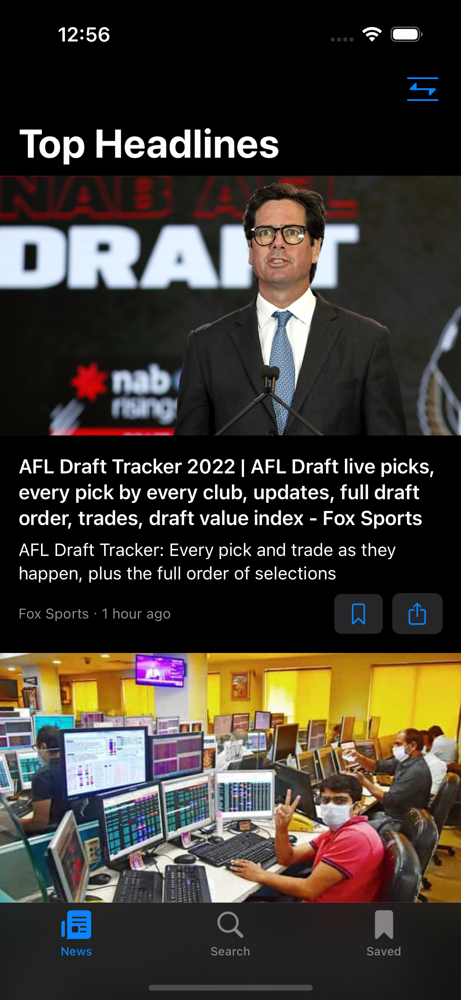
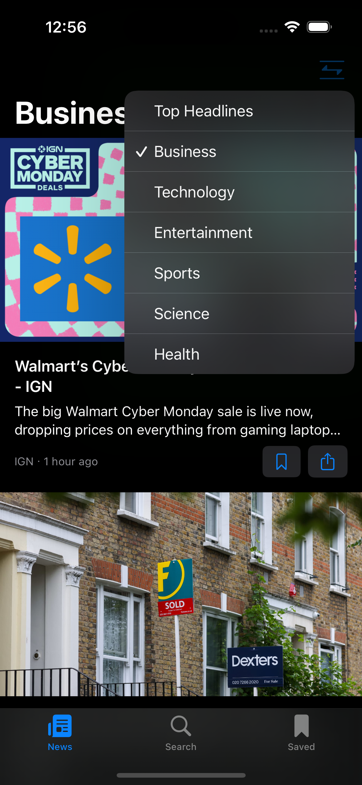
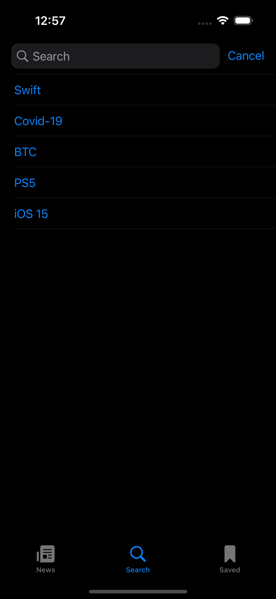
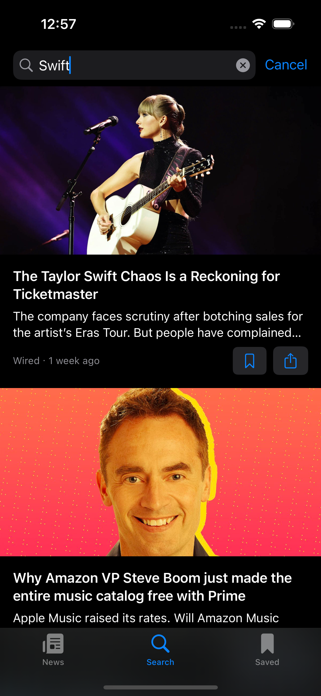
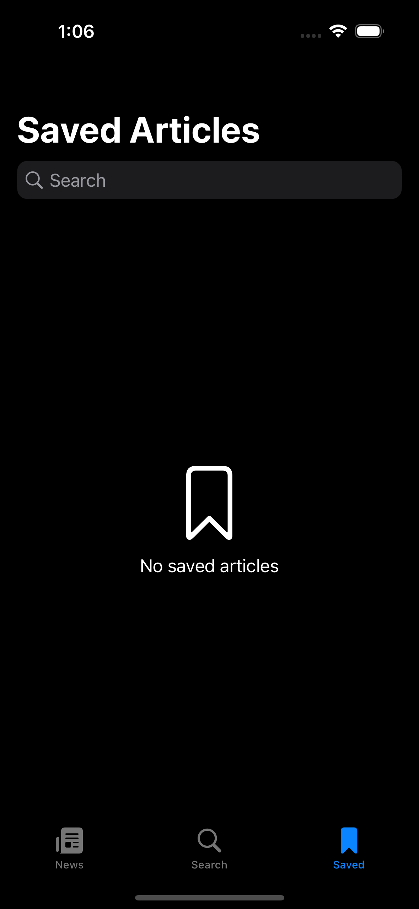

# NewsAppSwiftUI
## Overview
NewsApp is a SwiftUI-based iOS application that leverages the NewsAPI to fetch and display news articles. Users can explore news based on various categories, search for specific topics, view their search history, bookmark articles, and share links. The app also allows users to open news articles in Safari for a more detailed reading experience.
News app built using MVVM architecture.

## Features
- News Categories: Explore news articles across various categories - Business, Sports, Technology, Entertainment, Science, and Health.
- Search History: Easily revisit recent searches with the app's search history feature.
- Bookmarking: Save your favourite articles using Core Data for persistent storage. Access them in the Bookmarks view.
- Safari Integration: View full articles by opening links in the Safari browser directly from the app
- Sharing: Share interesting articles with friends and family through the native iOS sharing functionality.

## Code Snippet
```
//
//  SafariView.swift
//  NewsAppSwiftUI
//
//  Created by Muktar Hussein on 27/11/2022.
//

import SwiftUI
import SafariServices

struct SafariView: UIViewControllerRepresentable {
    
    let url: URL
    
    func makeUIViewController(context: Context) -> some SFSafariViewController {
        SFSafariViewController(url: url)
    }
    
    func updateUIViewController(_ uiViewController: UIViewControllerType, context: Context) {}
    
}

```
## Home 
<div>


</div>

## Search 
<div>


</div>

## Bookmarks
<div>


</div>

## Tools and Frameworks
- SwiftUI: Declarative UI framework for building robust and interactive user interfaces.
- Core Data: Apple's framework for data management, used here for persistent storage of bookmarks.
- SafariServices: Integrated for a seamless browsing experience within the app.

  ## Getting Started
1. Clone the repository.
  ```
git clone https://github.com/Huss3n/NewsAppSwiftAppSwiftUI
```
2. Open the project in Xcode.
3. Build and run the app on a simulator or a physical device.

  ##  License
  This project is licensed under the <a href="https://opensource.org/license/mit/"> MIT License.</a> Feel free to contribute!

